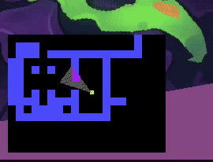
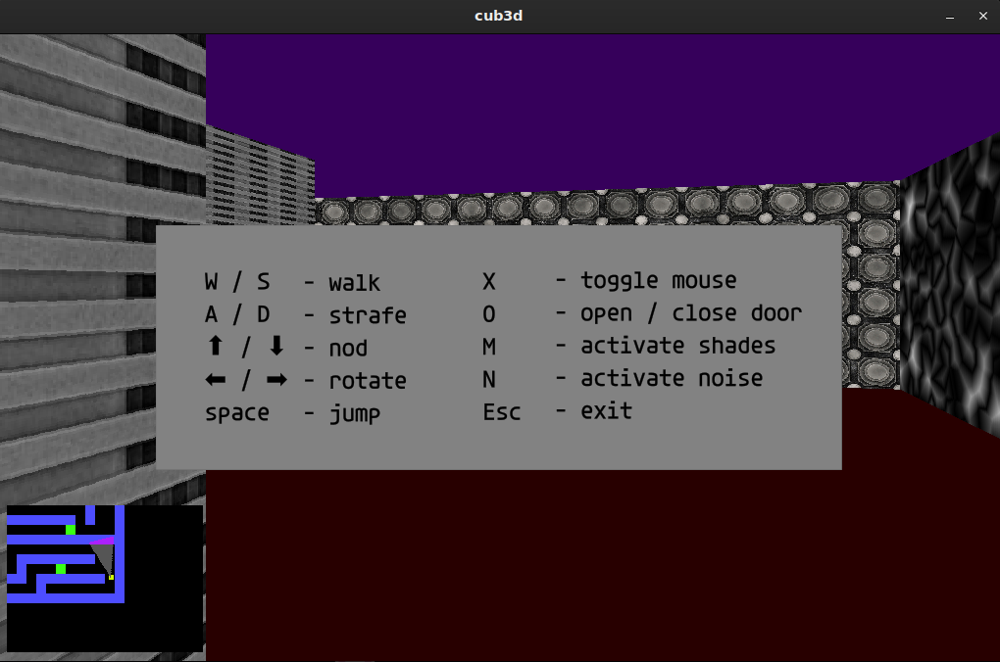

# cub3d

Cub3D is a simple raycasting 3D engine inspired by Wolfenstein 3D and Doom.  
It was built for the 42/School project requirements using minilibX.  
The player can explore a 2.5D maze, open doors, and navigate with WASD-style movement.  

---

## 📸 Demo

- Gameplay:  
    

    

- Minimap:  
    

---

## ⚙️ Requirements

- clang compiler  
- make  
- minilibX  
- X11 libraries (for Linux)  

---

## Installation

Clone the repository:
```bash
git clone https://github.com/yourname/cub3d.git
cd cub3d
```

### On RPM-based distros

Install dependencies:
```bash
sudo dnf install libX11-devel libXext-devel libXrender-devel libbsd-devel
```
for debian based use apt and do your own research on missing packages

## Configuration

In minilibx_linux/Makefile.mk:4, change the compiler to match school requirements:
```make
CC = clang
```

Your own files should also be compiled using clang.

## Running the Game

```bash
make
./cub3D maps/example.cub
```

Use arrow keys / WASD to move around, and ESC to quit.

  

## Features

- Raycasting engine with textured walls
- Doors (use `2` in map files)
- Custom map support (`.cub` files)
- Keyboard navigation

## Map Format

Maps are defined using `1` for walls, `0` for empty space, `2` for doors, and a starting position marked with `N`, `S`, `E`, or `W`.

Example:
```
111111
1000N1
102001
111111
```
Textures:
- PBR Texture Pack by Julio Sillet(https://www.artstation.com/juliovii) is licensed under CC BY 4.0. To view a copy of this license, visit https://creativecommons.org/licenses/by/4.0 
- Monster Skin texture pack by Lynocs (https://lynocs.itch.io/texture-pack)
